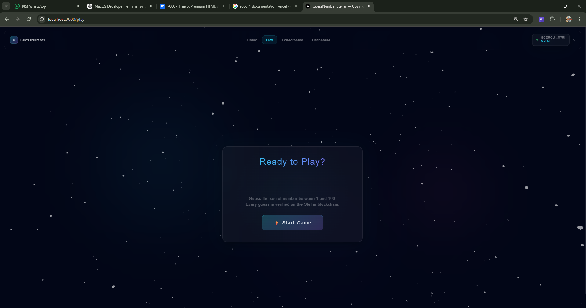
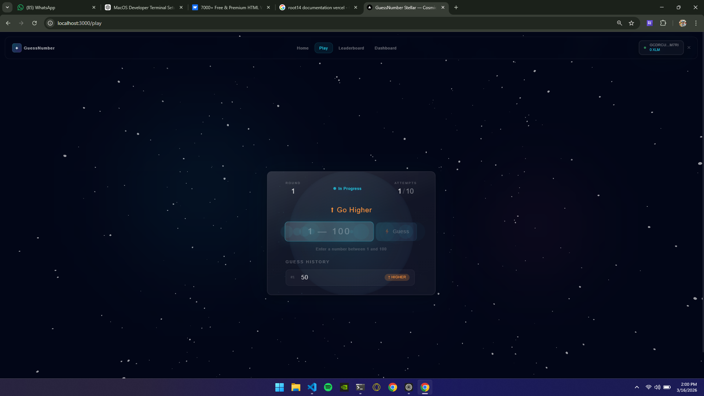

# GuessNumber Stellar

A full-stack number guessing game with a cinematic Next.js frontend, Express API backend, and Soroban smart contract integration on Stellar testnet.

## Photos


## Overview

GuessNumber Stellar lets a player connect a wallet, start a game round, submit guesses, and receive hint feedback (`higher`, `lower`, `correct`, `gameover`).

The app is built with:

- Frontend: Next.js 14, React 18, TypeScript, Tailwind, Framer Motion, GSAP, Three.js/R3F, Zustand
- Backend: Node.js + Express (REST API + on-chain invocation bridge)
- Smart contract: Soroban Rust contract (`contracts/hello-world`)

The backend supports three execution modes for each game action:

- `onchain`: transaction submitted to Soroban successfully
- `fallback`: on-chain failed but API recovered in non-strict mode
- `mock`: on-chain disabled by config

## Current Deployed Contract

- Testnet contract ID: `CAMFFBGSYGTB7JINIKG5XKVQG242MBVZQJW66JD6EZQICHUSIKPRUVBE`
- Explorer link: https://lab.stellar.org/r/testnet/contract/CAMFFBGSYGTB7JINIKG5XKVQG242MBVZQJW66JD6EZQICHUSIKPRUVBE

## Monorepo Structure

```text
guessnumber/
  backend/                 # Express API + Soroban CLI bridge
    server.js
    sorobanService.js
  contracts/
    hello-world/           # Soroban contract package
      src/lib.rs
      src/test.rs
      Makefile
  frontend/                # Next.js app
    src/app/
    src/components/
    src/stores/
    src/lib/api.ts
```

## Feature Set

- Wallet connect with official Freighter API flow and compatibility fallback
- Full game lifecycle via REST:
  - start game
  - submit guess
  - fetch game snapshot
  - leaderboard
- Chain receipt returned in gameplay responses (`mode`, `txHash`, `contractId`, etc.)
- Strict on-chain mode for hard-fail behavior in production-like runs
- Animated glassmorphism UI with particle background and motion-driven transitions

## Prerequisites

Install these locally before running:

- Node.js 18+ and npm
- Rust stable toolchain
- Stellar CLI with Soroban support (`stellar` command)
- Freighter browser extension (optional but recommended)

## Quick Start (Local)

### 1) Install dependencies

From repository root:

```bash
cd backend
npm install

cd ../frontend
npm install
```

### 2) Configure backend environment

Create/update `backend/.env`:

```env
PORT=4000
SOROBAN_ENABLE_ONCHAIN=true
STRICT_ONCHAIN=false

SOROBAN_CONTRACT_ID=CAMFFBGSYGTB7JINIKG5XKVQG242MBVZQJW66JD6EZQICHUSIKPRUVBE
SOROBAN_NETWORK=testnet
SOROBAN_RPC=https://soroban-testnet.stellar.org
SOROBAN_NETWORK_PASSPHRASE=Test SDF Network ; September 2015

# Identity alias or public key
SOROBAN_SOURCE=alice

# Optional: only needed for explicit key signing mode
SOROBAN_SECRET=

SOROBAN_CLI_PATH=stellar
```

### 3) Configure frontend environment

Create/update `frontend/.env.local`:

```env
NEXT_PUBLIC_API_URL=http://localhost:4000
```

### 4) Start backend and frontend

In separate terminals:

```bash
cd backend
npm run dev
```

```bash
cd frontend
npm run dev
```

Open:

- Frontend: http://localhost:3000
- Backend health: http://localhost:4000/api/health

## Runtime Modes and On-Chain Behavior

The backend uses `sorobanService.js` to invoke Soroban contract methods through the Stellar CLI.

Important flags:

- `SOROBAN_ENABLE_ONCHAIN=true|false`
- `STRICT_ONCHAIN=true|false`

Behavior matrix:

- `ENABLE_ONCHAIN=false`: API responds with `chainReceipt.mode = mock`
- `ENABLE_ONCHAIN=true` and `STRICT_ONCHAIN=false`: failures return `chainReceipt.mode = fallback`
- `ENABLE_ONCHAIN=true` and `STRICT_ONCHAIN=true`: failures return HTTP `502` (no fallback)

Every gameplay response includes a chain receipt payload with fields like:

- `mode`
- `txHash` / `tx_hash`
- `contractId`
- `chainGameId`
- `error` (when fallback/error path is used)

## API Reference

Base URL: `http://localhost:4000`

Endpoints are exposed with and without `/api` prefix.

### Start Game

- `POST /start-game`
- `POST /api/start-game`

Request:

```json
{
  "wallet": "G...",
  "maxAttempts": 10
}
```

Notes:

- `maxAttempts` must be an integer between `1` and `20`

### Submit Guess

- `POST /submit-guess`
- `POST /api/submit-guess`

Request:

```json
{
  "gameId": "game_xxx",
  "guess": 57
}
```

Notes:

- `guess` must be an integer between `1` and `100`

### Get Game Snapshot

- `GET /game/:id`
- `GET /api/game/:id`

### List Games

- `GET /games`
- `GET /api/games`
- Optional query: `?wallet=G...`

### Leaderboard

- `GET /leaderboard`
- `GET /api/leaderboard`

### Health

- `GET /api/health`

Returns service status, strict mode flag, active game count, and uptime.

## Frontend Routes

- `/` home page
- `/home`
- `/play`
- `/leaderboard`
- `/dashboard`
- `/game/[id]`

## Contract Development

Contract crate location: `contracts/hello-world`

### Run tests

From repository root:

```bash
cargo test -p hello-world
```

Or from contract folder:

```bash
cd contracts/hello-world
make test
```

### Build contract

```bash
cd contracts/hello-world
make build
```

### Deploy to testnet

From `contracts/hello-world`:

```bash
stellar contract deploy \
  --wasm ../../target/wasm32v1-none/release/hello_world.wasm \
  --source-account alice \
  --network testnet \
  --alias hello_world
```

After deploying, set `SOROBAN_CONTRACT_ID` in `backend/.env` to the new contract ID.

## Wallet Integration Notes

- Frontend uses `@stellar/freighter-api` first (`isConnected`, `requestAccess`)
- If unavailable, it falls back to legacy `window.freighterApi` behavior
- Wallet errors are surfaced in UI (`walletStore.error`) for debugging rejected requests or missing extension

## Troubleshooting

### Freighter not connecting

Check:

- Freighter extension is installed and enabled
- You are in the same browser profile where Freighter is installed
- Site permissions allow account access
- Popup blockers are not suppressing extension approval prompts

### Backend returns 502 in strict mode

If `STRICT_ONCHAIN=true`, any invoke failure intentionally hard-fails.

Steps:

- Verify `SOROBAN_CONTRACT_ID`, `SOROBAN_SOURCE`, and RPC settings
- Confirm `stellar` CLI is installed and accessible in PATH
- Test direct contract invoke via CLI to isolate API vs network issues

### Simulation passes but send fails (`InvokeHostFunction(Trapped)`)

This often indicates non-deterministic contract state/key derivation. Keep storage keys deterministic between simulation and submission.

### Next.js build/runtime oddities after crash or interrupted server

Clean and rebuild:

```bash
cd frontend
rm -rf .next
npm run build
npm run dev
```

PowerShell equivalent:

```powershell
Set-Location frontend
if (Test-Path .next) { Remove-Item -Recurse -Force .next }
npm run build
npm run dev
```

### Port conflicts

- Frontend default: `3000`
- Backend default: `4000`

If a port is occupied, stop the existing process or run on an alternate port.

## Validation Checklist

Use this before demos/deploy handoff:

```bash
# frontend
cd frontend
npm run lint
npm run build

# backend
cd ../backend
npm run dev

# contract
cd ..
cargo test -p hello-world
```

Manual runtime checks:

- `GET /api/health` returns `status: ok`
- Start game from UI and verify returned `chainReceipt.mode`
- Submit guesses until finish and confirm leaderboard updates

## Security and Production Notes

- Backend state is currently in-memory (`Map`), so data resets on restart
- Add persistent storage (Redis/Postgres) for production use
- Harden auth/session model before exposing public write endpoints
- Add backend test coverage and CI pipelines (frontend + backend + contract)

## License

No license file is currently defined in the repository root. Add one before open distribution.
